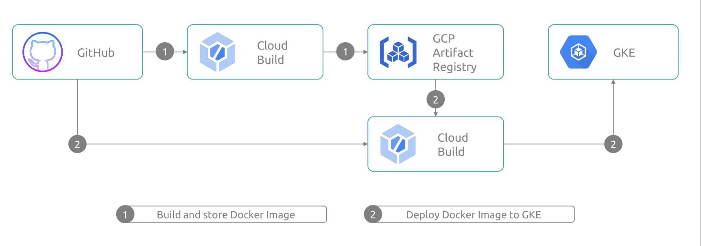

## Google Cloud Platform DevOps Project

# Tools used in the Project 
1. [Git](https://git-scm.com/doc)
2. [GitHub](https://docs.github.com/en)
3. [Google Cloud Platform](https://cloud.google.com/docs)
   a. CloudBuild
   b. GCP Artifact Registry
   c. Google Kubernetes Engine 
4. [Docker](https://docs.docker.com/)
5. [Kubernetes](https://kubernetes.io/docs/home/)

# CI-CD Pipeline Plan

